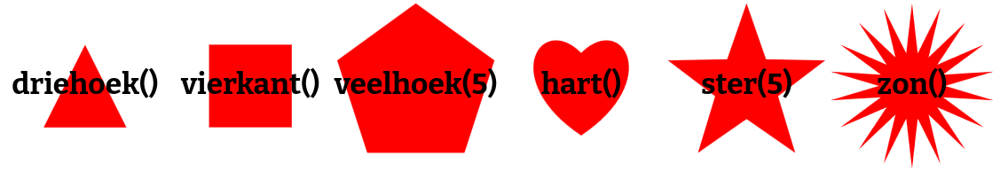
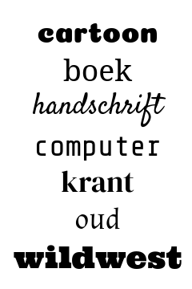

# DEMO 2 - Lagen en eigenschappen


## Lagen

Een demo bestaat uit lagen, bijvoorbeeld:

- een achtergrond
- dan een aantal bewegende vormen
- en bovenop rondvliegende tekst

Het startproject heeft 2 lagen: `laag(Achtergrond)` en `laag(Tekst)`.

Voeg nu tussen deze twee lagen een nieuwe laag toe:

```js
laag(Vorm)
```

Wat verandert er nu?

Probeer ook eens om de lagen om te wisselen. Wat gebeurt er dan? Begrijp jij hoe lagen getekend worden?


## Kleuren wijzigen

Elke laag heeft een aantal eigenschappen die je kunt wijzigen.

Voeg bijvoorbeeld dit toe na de regel `laag(Achtergrond)`:

```js
wijzig("kleur", "donkergroen")
```

Wat verandert er?

Probeer andere kleuren! Je kunt een naam opgeven (`"lichtblauw"`), een getal van 0 tot 100 (`0` is bijvoorbeeld rood, `20` is geel, enz.).

Kun je de `Vorm` en `Tekst` lagen ook andere kleuren geven?

Wat gebeurt er als je als kleur `kleur.regenboog()` gebruikt (zonder aanhalingstekens!)? En `kleur.regenboog(10)`?

> **TIP:** Als er iets misgaat, kun je je laatste wijzigingen ongedaan maken met <kbd>Ctrl+Z</kbd>: houd <kbd>Ctrl</kbd> ingedrukt en druk (een paar keer) op <kbd>Z</kbd>.


## Andere eigenschappen wijzigen

Elke laag heeft andere eigenschappen die je kunt wijzigen.

Als je bijvoorbeeld de `Vorm` laag een cirkel wilt laten tekenen:

```js
wijzig("vorm", vorm.cirkel())
```

Let op waar je deze regel plaatst! Zet `wijzig` altijd *na* de `laag` die je wilt wijzigen.

Er zijn ook andere vormen:



Natuurlijk kun je de tekst aanpassen:

```js
wijzig("tekst", "Coding is cool!")
```



> **TIP**: wil je tekst op meerdere regels? Gebruik `\n` om een nieuwe regel te beginnen!

Je kunt ook een ander lettertype gebruiken:

```js
wijzig("lettertype", "handschrift")
```

Alles staat nu nog stil, maar daar gaan we verandering in brengen, met [effecten](3%20-%20effecten.html)!

<p style='font-size: 150%; font-weight: bold; text-align: right;'>
    <a href='./3%20-%20effecten.html'>Volgende stap </a>
</p>