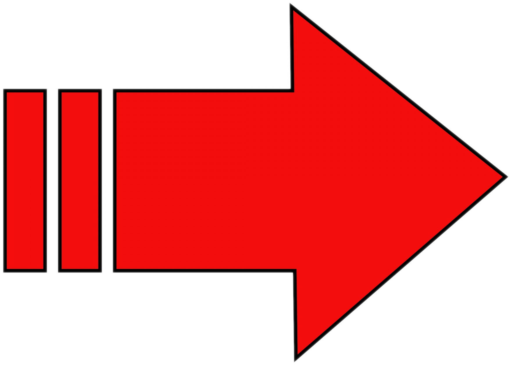

# DEMO 4 - Vermenigvuldig

<blockquote>
<details>
  <summary><u><b>TIP:</b> klik hier om te zien hoe je project er nu bijvoorbeeld uit kan zien</u></summary>

<p>(als jouw versie ietsje anders is: geen probleem, als je maar een `Vorm` laag hebt voor deze stap)</p>

<pre>
laag(Achtergrond)
wijzig("kleur", "donkergroen")

laag(Vorm)
wijzig("vorm", vorm.cirkel())

laag(Tekst)
wijzig("tekst", "Coding is cool!")
laag(Verplaats)
wijzig("pad", pad.omhoog(250))
laag(Draai)
wijzig("hoek", getal.golf(20, 50))
laag(Grootte)
wijzig("grootte", 120)
</pre>

</details>
</blockquote>

## Dezelfde vorm meerdere keren

Met het `Vermenigvuldig` effect kun je je `Vorm` een aantal keer kopiëren en in een cirkel zetten. Voeg deze regels toe na `laag(Vorm)` (en de `wijzig()` regel(s) die erachter staan):

```js
laag(Vermenigvuldig)
wijzig("aantal", 5)
```

Als het goed is, zie je nu 5 keer jouw vorm verschijnen! Natuurlijk kun je een ander aantal kiezen als je dat leuk vindt.

Laten we de vormencirkel laten draaien. Voeg na de regels hierboven deze regels toe:

```js
laag(Draai)
wijzig("hoek", getal.teller(100, 0, 360))
```

Kun je zelf zorgen dat de hele vormencirkel groter en kleiner wordt? Hint: gebruik een `Grootte` laag en `getal.golf(10, 90, 110)`.

Zou het niet leuk zijn als de cirkels ook groter en kleiner werden?
Voeg deze regels toe net boven de regel `laag(Vermenigvuldig)`:

```js
laag(Grootte)
wijzig("grootte", getal.golf(30, 50, 150))
```

Wat gebeurt er? Zie je dat de cirkels niet allemaal dezelfde grootte hebben? De `Vermenigvuldig` laag zorgt ervoor dat elke vorm iets is "verschoven in de tijd". Je kunt dit ook uitzetten als je wilt. Voeg na `laag(Vermenigvuldig)` deze regel toe:

```js
wijzig("variatie", 0)
```

Nu zijn alle vormen als het goed is hetzelfde. Je kunt voor de `variatie` ook andere waarden dan `0` proberen, bijvoorbeeld `10` of `30`.

We hebben nu de vorm in grootte laten veranderen, maar je kunt ook andere dingen aanpassen voor leuke effecten:

- Je kunt de kleur van de `Vorm` laag op `kleur.regenboog()` of `kleur.willekeurig()` zetten.
- Je kunt ook de `"afstand"` eigenschap van `Vermenigvuldig` wijzigen naar `getal.golf(10, 150, 250)`. Gek effect hè?
- Je kunt de `aantal` eigenschap bij `Vermenigvuldig` laten veranderen met `getal.golf(5, 3, 10)`.

In de [volgende stap](./5%20-%20voorbeeldjes.html) kijken we naar een aantal voorbeeldjes. Die brengen je vast op leuke ideeën!

<p style='font-size: 150%; font-weight: bold; text-align: right;'>
    <a href='./5%20-%20voorbeeldjes.html'>Volgende stap </a>
</p>